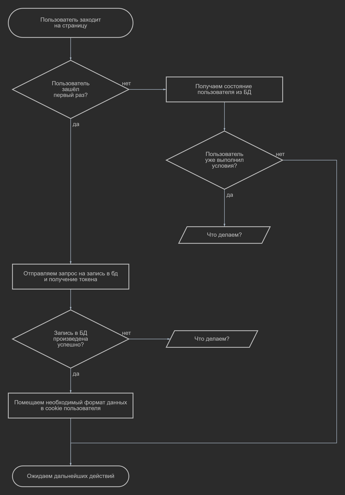
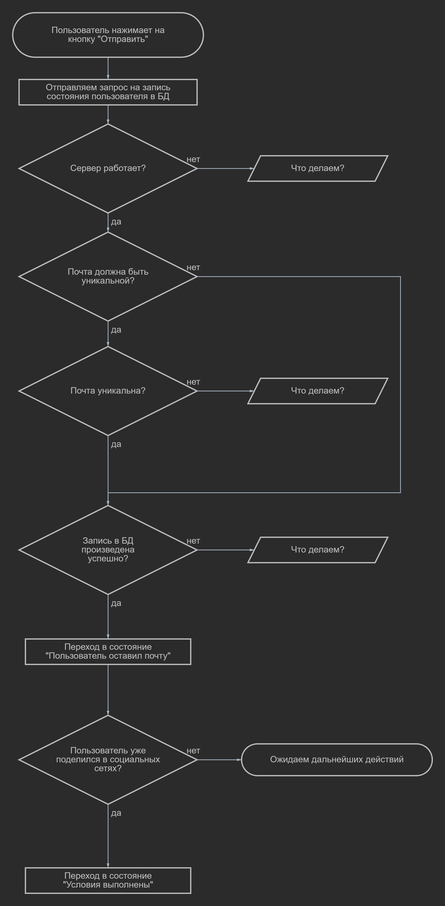
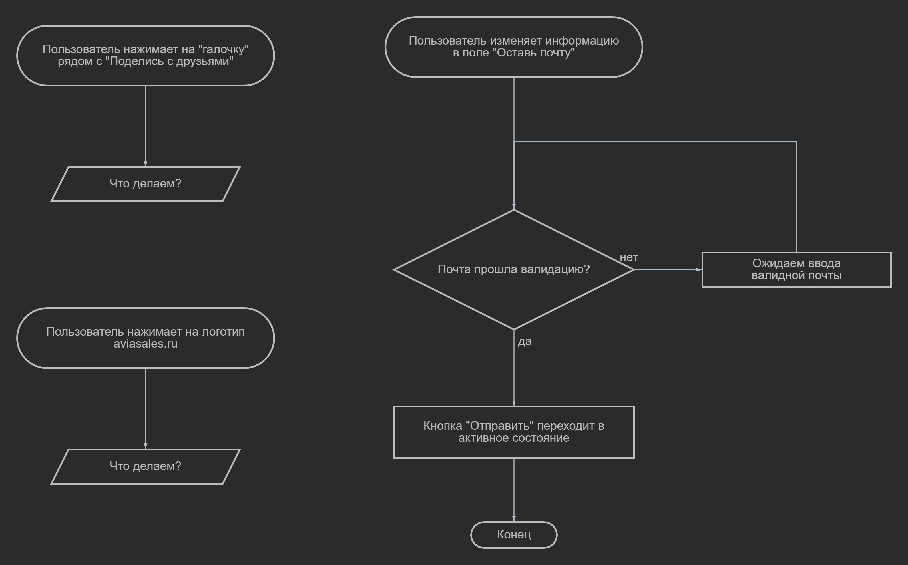

# УТОЧНЯЮЩИЕ ВОПРОСЫ

 

# 1. Фронтенд

 

## 1.1. Браузеры, устройства и размеры окна

  - **1.1.1.** В каких браузерах и в каком диапазоне версий необходимо реализовать корректное функционирование сайта?;

  - **1.1.2.** На каких устройствах необходимо реализовать корректное функционирование сайта?

  - **1.1.3.** Какие минимальное и максимальное разрешения экрана (ширина и высота) при которых необходимо корректно отображать сайт?;

  - **1.1.4.** Каковы диапазоны разрешений внутри которых необходимо корректно отображать сайт? ("Все" - если необходимо поддерживать весь   диапазон от минимального до максимального разрешения);

  - **1.1.5.** Что должно происходить в случае, если выключена поддержка JS в браузере?;

  - **1.1.6.** Какова стратегия отображения контента при медленном интернет соединении?;

 

## 1.2. Активные иконки и ссылки

  - **1.2.1.** В примере есть ссылка на "Правила", которая открывает модальное окно с правилами. Нужно ли оно в тестовом? Если да, то текст правил такой же как в примере реализации или другой?;

  - **1.2.2.** В примере, при клике на логотип, происходит переход на главную страницу. Необходимо реализовать такое же поведение?

  - **1.2.3.** Предполагается ли изменение соц. сетей используемых в событии?

 

## 1.3. Блок "Поделиться с социальной сети"

  - **1.3.1.** Что должно происходить если API социальной сети не работает?;

  - **1.3.2.** В задаче указана необходимость дать возможность поделиться только в одной из социальных сетей. Это осознанное решение? Что делать пользователю, если он захочет поделиться, также, в другой социальной сети?;

  - **1.3.3.** Что должно происходить на клиенте, в рамках текущего действия, если запрос к серверу возвращает ошибку?;

  - **1.3.4.** В примере, пользователь может просто закрыть модальное окно и не поделиться в соц. сети, при этом система зачтет это как то, что пользователь поделился. Это осознанное решение? Необходимо ли реализовать проверку на то, что пользователь действительно поделился в соц. сети, при возможности реализации данного функционала с использованием api конкретной соц. сети?

  - **1.3.5.** Когда блок переходит в состояние "Выполнено", появляется иконка с галочкой в квадрате. Иконка выглядит как интерактивный чек-бокс и на неё хочется нажать, но при нажатии ничего не происходит и мозг "ощущает" это как не работающий функционал. Это осознанное решение? Возможно стоит поменять иконку или дать возможность отменить состояние "Выполнено" и поделиться, также, в другой социальной сети?;

  - **1.3.6.** Необходимо ли отслеживать, что на одну и туже страницу в социальной сети пытаются поделиться более одного раза, с, возможно, разных пользователей? Для события это неэффективно и это можно, попытаться, отслеживать через api социальных сетей которое используется на сайте, добавляя в базу данных запись о том, на какие страницы каких социальных сетей происходил репост. Если необходимо это отслеживать, то что должно происходить на клиенте, когда пользователь пытается поделиться на страницу, на которую уже делились этим событием?

  - **1.3.7.** Необходимо ли реализовать возможность поделиться ещё раз в той же социальной сети (например, если пользователь по какой-то причине удалил пост и хочет поделиться заново)? Это требование может конфликтовать с отслеживанием уникальности страницы в социальной сети из пункта 1.3.6

 

## 1.4. Блок "Сохранить почту"

  - **1.4.1.** Что должно происходить на клиенте, в рамках текущего действия, если запрос к серверу возвращает ошибку?;

  - **1.4.2.** Должна ли почта быть уникальной? Если да, то что должно происходить на клиенте если почта не уникальна?;

  - **1.4.3.** Дублирование вопроса 1.3.6 в отношении блока "Сохранить почту";

  - **1.4.4.** Необходимо ли реализовать возможность перезаписать сохраненную почту на другую для этого пользователя? Например, если пользователь по ошибке ввёл некорректную почту и т.д.

 

## 1.5. Обработка состояния на клиенте

  - **1.5.1.** При использовании cookies, должно ли реализоваться получение подтверждения, от пользователя, на их использование? Если да, то каким образом?;

  - **1.5.2.** Что должно происходить на клиенте, когда пользователь повторно зашёл на сайт, но до этого уже выполнил все условия? Необходимо сразу показывать финальный экран или расценивать как нового пользователя? (Вдруг зашли брат/мама/кошка/жена чтобы тоже поучаствовать?);

  - **1.5.3.** Что должно происходить на клиенте, в рамках текущего действия, если запрос к серверу возвращает ошибку?;

 

## 1.6. Специальные возможности

  - **1.6.1** Необходимо ли реализовать возможность корректного пользования сайтом для людей с ограниченными возможностями? Например, пользование сайтом без использования мыши или клавиатуры, пользование сайтом для незрячих или слабовидящих людей? 

 
 

# 2. Бэкэнд

 

## 2.1. Хранение состояний

 - **2.1.1.** Существую ли какие-то, устоявшиеся внутри команды, методы хранения данных о пользователе в рамках сессии? В примере используется хранение сессии в cookie, это обязательный подход? Существует ли какая-либо бизнес логика влияющая на выбор метода хранения данных пользователя? 

 - **2.1.2.** Сколько по времени нам необходимо хранить, в базе данных, данные пользователя, который не выполнил условия?

 - **2.1.3.** Сколько по времени нам необходимо хранить, в базе данных, данные пользователя, который выполнил условия?

 - **2.1.4.** Необходимо ли нам хранить, в базе данных, промежуточное состояния пользователя? Когда он только поделился в социальной сети или только сохранил почту?

 

## 2.2. Экспорт данных

 - **2.2.1.** Необходимо ли реализовать метод выгрузки базы данных в каком-то определенном формате? Например для подведения итогов конкурса;

 - **2.2.2.** Необходимо ли реализовать метод получения случайного или случайных пользователей из базы данных? Например для подведения итогов конкурса;

 - **2.2.3.** Необходимо ли реализовать api для обмена данными с другими сервисами?.
 
 

## 2.3. Нагрузка

 - **2.3.1.** Какова расчетная посещаемость сайта в день?;
 
 - **2.3.2.** Каково расчетное количество пользователей выполняющих все условия до конца? (Необходимо для приблизительного расчета количества запросов к базе данных в секунду);

 - **2.3.3.** Какое количество дней будет проходить данное событие? (Необходимо для приблизительного расчета необходимого места под хранение данных);

 - **2.3.4.** Каково максимально допустимое время ожидания пользователем ответа от сервера?;

 - **2.3.5.** Каково максимально допустимое время устаревания данных о пользователях в базе данных?;

 - **2.3.6.** Каков максимально допустимый период потери данных о пользователях? (Необходимо для расчета частоты бэкапов базы данных);
 
 

 ## 2.4. Безопасность

 - **2.4.1.** Определена ли, путём анализа предыдущих схожих проектов, конкретная модель угроз?
 
 

 ## 2.5. Интернализация

 - **2.5.1.** Предполагается ли локализация сайта события на языки отличные от русского?
 
 

 ## 2.6. Повторное использование

 - **2.6.1.** Предполагается ли переиспользовать составные части проекта или весь проект целиков для реализации будущих событий?

 
 

 # Блок-схемы. сопутствующие выработке списка вопросов

 ## Пользователь заходит на страницу

 
 

 ## Пользователь нажимает на кнопку "Поделиться в социальной сети"

 
 

 ## Пользователь нажимает на кнопку "Отправить"

 
 

 ## Пользователь изменяет информацию в поле "Оставь почту" / Пользователь нажимает на логотип aviasales.ru / Пользователь нажимает на "галочку" рядом с "Поделись с друзьями"

